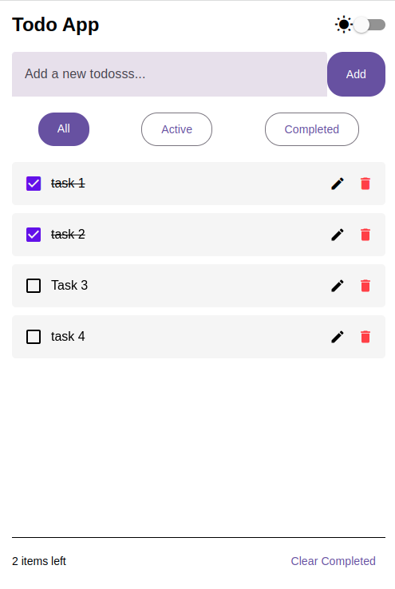
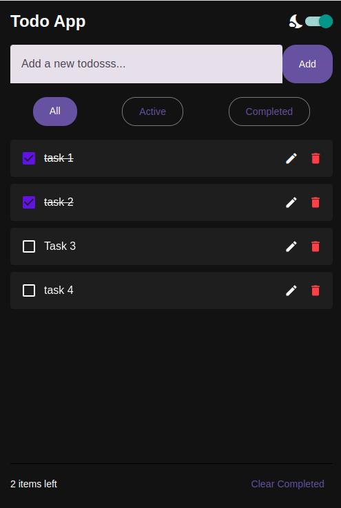

# React Native Todo App 📱✅
A feature-rich Todo application built with React Native, featuring dark/light mode, persistent storage, and smooth animations.

## Screenshots 🖼️

| Light Mode | Dark Mode |
|------------|-----------|
|  |  |

## Features ✨

- ✅ Add, edit, and delete todos
- 🌓 Dark/Light mode toggle
- 📂 Filter todos (All/Active/Completed)
- 💾 Persistent storage with AsyncStorage
- 🎨 Themed UI with React Native Paper
- 🔄 Smooth animations
- 📱 Responsive design for all devices

## Installation 🛠️

1. **Clone the repository**
2. cd todo-app
3. npm install
4. npm start

